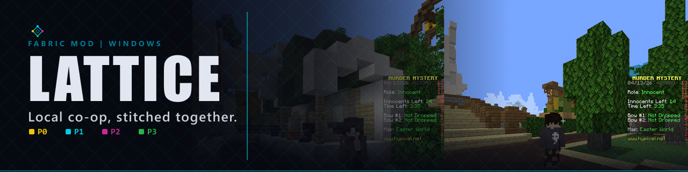
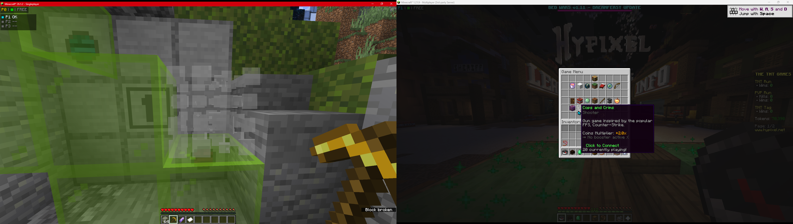
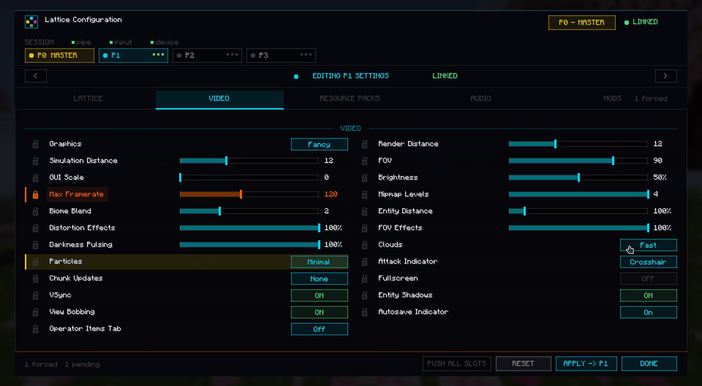
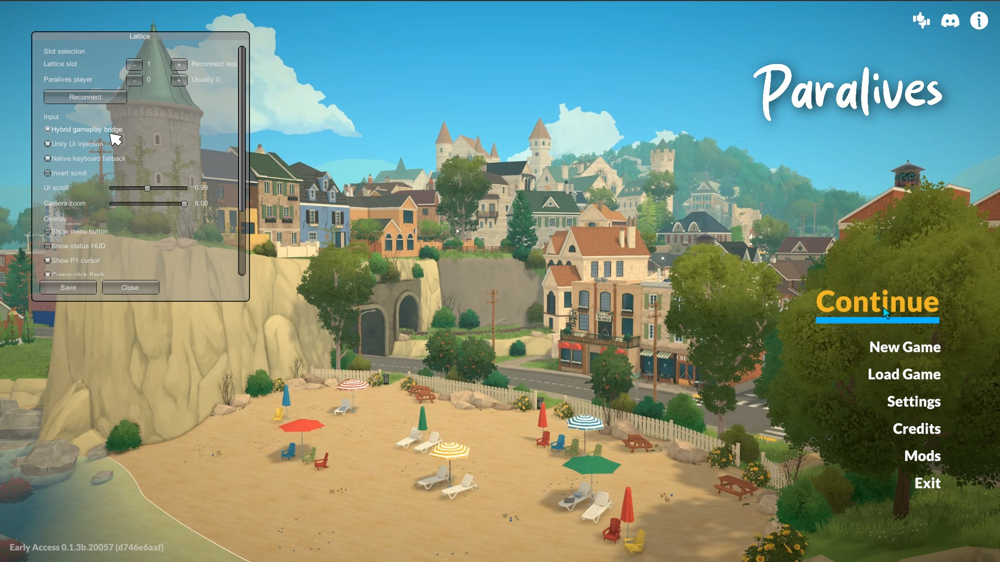
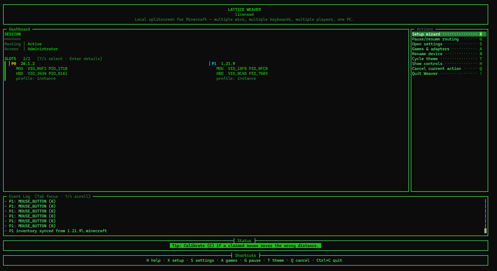
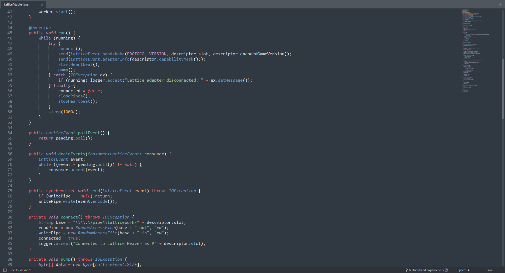

# Lattice

**Lattice is local couch co-op for Windows** — two or more people share one PC and play at the
same time, each in their own game window with their **own mouse and keyboard**.

Lattice has two parts:

- **Lattice Weaver** — a Windows companion app that runs guided setup, assigns each player's
  devices to a player slot, and routes those claimed devices into supported games. Player 1 (P0)
  keeps normal native Windows control; extra players (P1+) drive their own instance.
- **Game adapters** — per-game integrations that receive a player's routed input. The Minecraft
  adapter (a Fabric mod) also adds an in-game HUD, virtual cursor, and P0 master controls for
  settings, resource packs, and per-slot profiles.

GitHub hosts the release assets (Weaver binary, mod jars, the developer devkit) and this overview.
Minecraft players can also grab the mod from **[Modrinth](https://modrinth.com/mod/latticework)**.
Lattice Weaver is sold as a one-time license at **[bide.cx](https://bide.cx)**.

## Supported games

| Game | Status | Notes |
|------|--------|-------|
| **Minecraft Java** | ✅ Supported | Versions `1.20` – `26.1.2`, Fabric-based. HUD, virtual cursor, and P0 master settings/profile/resource-pack controls. |
| **Paralives** | ✅ Supported | Game-adapter (BepInEx plugin). Independent per-player cursor, scroll, click, keyboard, and UI input. |

Lattice Weaver is required for routing in every supported game.

## How it works

1. **Install Lattice Weaver** and run it. It opens a guided setup.
2. **Assign devices the easy way** — when Weaver asks, move the mouse or press a key on the set you
   want to be Player 1, then Player 2, and so on. Whatever device you actuate is claimed for that
   slot. P0 keeps native control; P1+ devices are routed to their game instances.
3. **Launch a supported game instance per player.** Weaver sends each player's claimed mouse and
   keyboard to their own window.

## Downloads

- **Lattice Weaver** (Windows companion, required) — [bide.cx](https://bide.cx) /
  [GitHub Releases](https://github.com/bideco/lattice-weaver/releases).
- **Minecraft mod jars** — [Modrinth](https://modrinth.com/mod/latticework) or GitHub Releases.
  Pick the jar matching your Minecraft version:

  | Minecraft version | Jar |
  |---|---|
  | 1.20 | `latticework-1.0.0+1.20.jar` |
  | 1.20.1 – 1.20.6 | `latticework-1.0.0+1.20.1-1.20.6.jar` |
  | 1.21 – 1.21.4 | `latticework-1.0.0+1.21-1.21.4.jar` |
  | 1.21.5 | `latticework-1.0.0+1.21.5.jar` |
  | 1.21.6 – 1.21.8 | `latticework-1.0.0+1.21.6-1.21.8.jar` |
  | 1.21.9 – 1.21.11 | `latticework-1.0.0+1.21.9-1.21.11.jar` |
  | 26.1 – 26.1.2 | `latticework-1.0.0+26.1-26.1.2.jar` |

- **Paralives plugin** — `Lattice.Paralives.dll`, from GitHub Releases.

A one-time license unlocks Lattice Weaver for supported games; a free trial is available to try it
first. Order emails come from `orders@bide.cx`.

## Minecraft setup

1. Install [Fabric Loader](https://fabricmc.net/use/) and
   [Fabric API](https://modrinth.com/mod/fabric-api) (and
   [Mod Menu](https://modrinth.com/mod/modmenu) for the in-game config screen).
2. Give each player their own instance (Prism Launcher / MultiMC make this easy) and copy the
   matching Lattice jar into each instance's `mods` folder.
3. Run **Lattice Weaver guided setup** to claim each player's devices.
4. Assign each instance's player slot — either through Weaver's JVM setup or by adding the launcher
   JVM argument `-Dlattice.player=0` (Player 1), `-Dlattice.player=1` (Player 2), and so on.
5. Start Weaver first, then launch each Minecraft window.

The P0 player gets a master settings screen to control P1+ instances — audio/video, resource packs,
and per-slot profiles, where supported.

## Paralives setup

1. Install [BepInEx](https://docs.bepinex.dev/articles/user_guide/installation/index.html) into your
   Paralives folder.
2. Copy `Lattice.Paralives.dll` into `Paralives\BepInEx\plugins\`.
3. Run Weaver guided setup, then launch Paralives — the second player gets their own on-screen
   cursor in their player color.

## Lattice Weaver

Weaver handles device assignment, player slots, routing, and the supported-game adapters. It is
**closed-source** and distributed as a signed Windows binary; this repository hosts the public
release assets and the developer devkit, not the Weaver source.

## Devkit

The **Lattice Devkit** is for developers who want to integrate a game with Lattice. It contains the
manifest schema, sample manifests, and the Java and C# adapter SDK surfaces, plus the adapter
contract docs (see [`sdk/`](sdk/)). Adapters declare their capabilities and receive only the public
adapter surface — Weaver keeps routing, licensing, and device-claim internals private.

## Notes

- Lattice Weaver is **Windows 10/11 only**.
- One mouse + one keyboard per player (P0 can use the PC's main set).
- The download builds are protected; please don't redistribute. Support: `support@bide.cx`.
