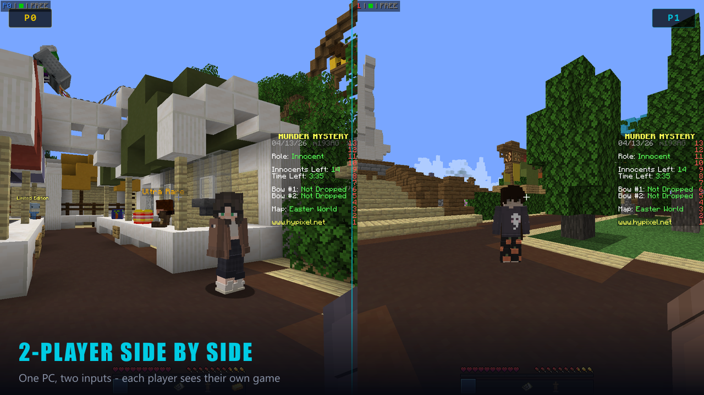
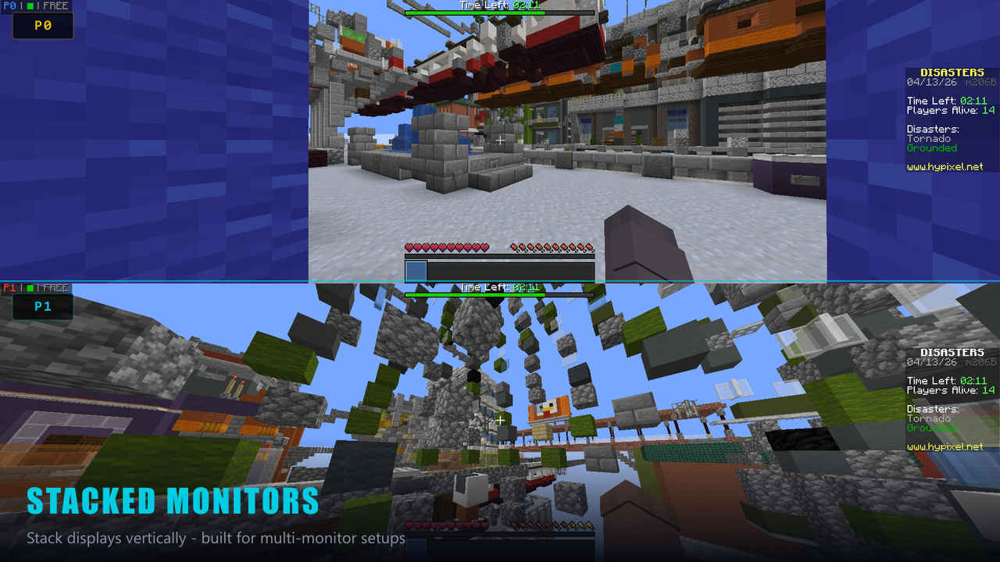
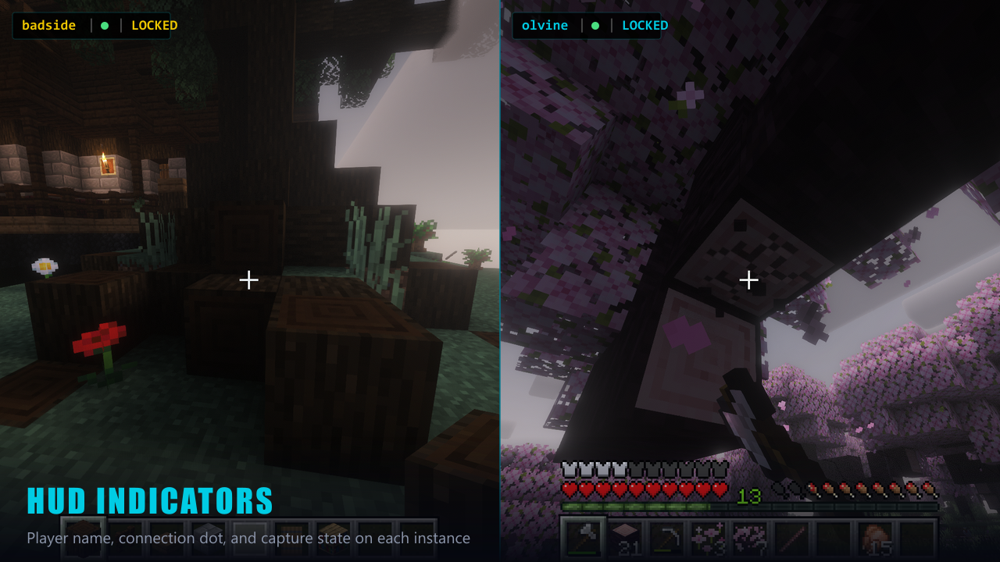
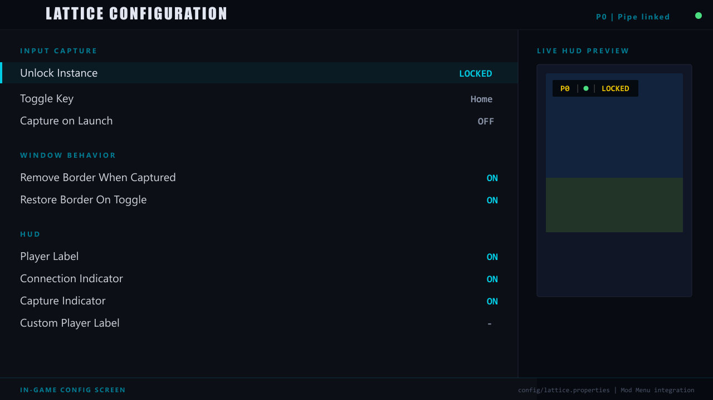
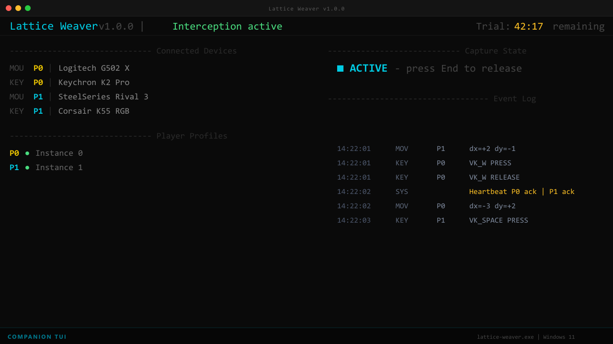

# Lattice


Lattice is a local couch co-op project for Minecraft Java Edition. It combines a Fabric mod with a Windows companion app so multiple keyboards and mice can be routed to different Minecraft instances on the same machine.

GitHub is the full project home:
- versioned mod jars for supported Minecraft ranges
- `lattice-weaver.exe`, the Windows companion app
- screenshots, icons, and release assets

Modrinth remains the easiest mod-only download:
- https://modrinth.com/mod/latticework

## What It Does

- Routes separate keyboards and mice to separate Minecraft instances
- Handles duplicate-slot launches and active-instance switching
- Surfaces slot state, profile state, and hotplug issues in-game with consistent toasts
- Restores per-instance settings snapshots so each instance can keep its own `options.txt` and Lattice config
- Supports slot default profiles through the companion for fresh instances
- Includes a companion TUI for capture state, device mapping, warnings, and profile status

## Downloads

Use the release asset that matches your Minecraft version:

- `1.20.1-1.20.6`
- `1.21-1.21.4`
- `1.21.5`
- `1.21.6-1.21.8`
- `1.21.9-1.21.11`
- `26.1-26.1.2`

Also grab:

- `lattice-weaver.exe`
- Fabric API
- Mod Menu if you want the in-game config screen

## Setup

1. Put the matching Lattice jar in each instance's `mods` folder.
2. Install Fabric API for the instance.
3. Launch the companion app before starting Minecraft.
4. Start each instance with its player slot JVM arg, for example `-Dlattice.player=0`.
5. Use the companion to identify devices, manage slot defaults, and monitor capture state.

## Companion Features

- Global capture toggle with slot-aware routing
- Device assignment and hotplug recovery
- Manual device reassignment flow for changed or ambiguous devices
- Per-instance profile snapshot and restore
- Slot default profile imports with:

```powershell
lattice-weaver.exe --slot0-profile="C:/Users/Nicholas/Downloads/MultiMC/instances/1.20"
```

## Screenshots

### Side-by-side play



### Stacked monitor layout



### HUD indicators



### Config screen



### Companion TUI



## Notes

- The companion app is Windows-only.
- Interception is recommended for full keyboard isolation.
- GitHub releases carry both the mod jars and the companion executable.
